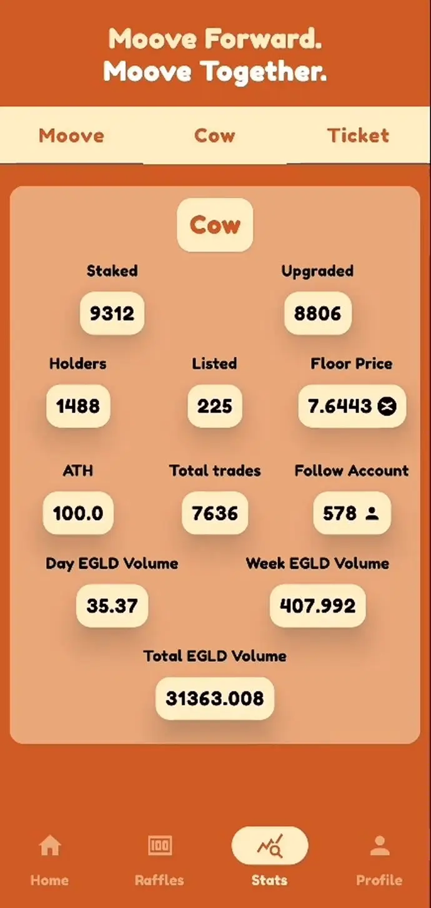

# Hello CowCow

**Hello CowCow** est une application Android conçue pour améliorer votre expérience avec la collection NFT CowCow sur la blockchain MultiversX. Cette application se connecte à l'application xPortal, vous offrant des informations détaillées sur la collection CowCow et son jeton natif "Moove". De plus, Hello CowCow vous permet de gérer vos NFT, de consulter le contenu de votre portefeuille, de vérifier les NFT mis en staking et de suivre les NFT répertoriés sur le marché.

## Table des matières

- [Fonctionnalités](#fonctionnalités)
- [Captures d'écran](#captures-décran)
- [Technologies utilisées](#technologies-utilisées)
- [Architecture](#architecture)
- [Démarrage](#démarrage)
- [Contact](#contact)

## Fonctionnalités

- **Intégration du Portefeuille :** Connectez-vous en toute transparence à votre portefeuille xPortal.
- **Analyse de la collection :** Accédez à des informations complètes sur la collection CowCow.
- **Données du marché :** Surveillez les 10 ventes les plus récentes sur le marché.
- **Aperçu des statistiques :** Plongez dans des statistiques détaillées sur la collection CowCow et le jeton Moove.
- **Profil :** Gérez vos NFT avec des sections dédiées pour votre portefeuille, les NFT mis en staking et les annonces sur le marché.
- **Informations détaillées sur les NFT :** Obtenez des détails approfondis sur chaque NFT.
- **Réclamez les jetons Moove :** Réclamez facilement vos jetons Moove et signez en toute sécurité des transactions via xPortal.

## Captures d'écran

### Écran de démarrage et Connexion
            

### Accueil
        

### Raffles

### Statistiques
        

### Profil
        

### Détails des NFT
    
    

### Réclamez les jetons Moove
    
    

## Technologies utilisées

- **Environnement de développement :** Android Studio
- **Langage de programmation :** Kotlin
- **Cadre d'interface utilisateur :** Jetpack Compose
- **Intégration du portefeuille :** WalletConnect
- **Programmation réactive :** RxJava3
- **Requêtes API :** Retrofit
- **Injection de dépendances :** Hilt/Dagger
- **Chargement d'images :** Glide

## Architecture

Hello CowCow suit le modèle architectural **MVVM**. Le projet met l'accent sur les principes de l'architecture propre, garantissant la maintenabilité et la scalabilité.

## Démarrage

1. **Cloner le projet :** Commencez par cloner le projet sur votre machine locale.
2. **Ouvrir dans Android Studio :** Lancez Android Studio et ouvrez le projet depuis le répertoire cloné.
3. **Construire et Exécuter :** Compilez le projet et exécutez-le sur votre appareil Android.

## Contact

Pour des questions ou un support, n'hésitez pas à me contacter à [elytevolution@gmail.com](mailto:elytevolution@gmail.com).

---

